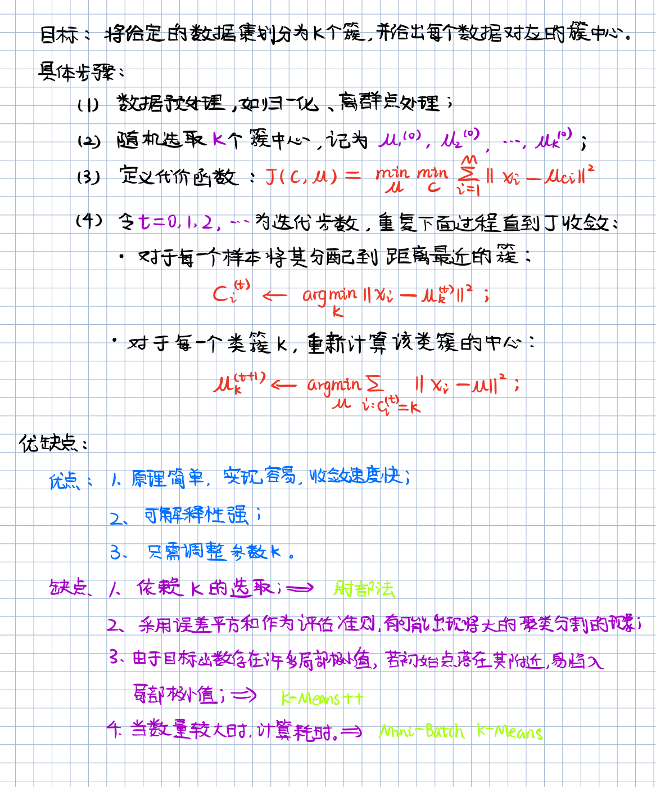
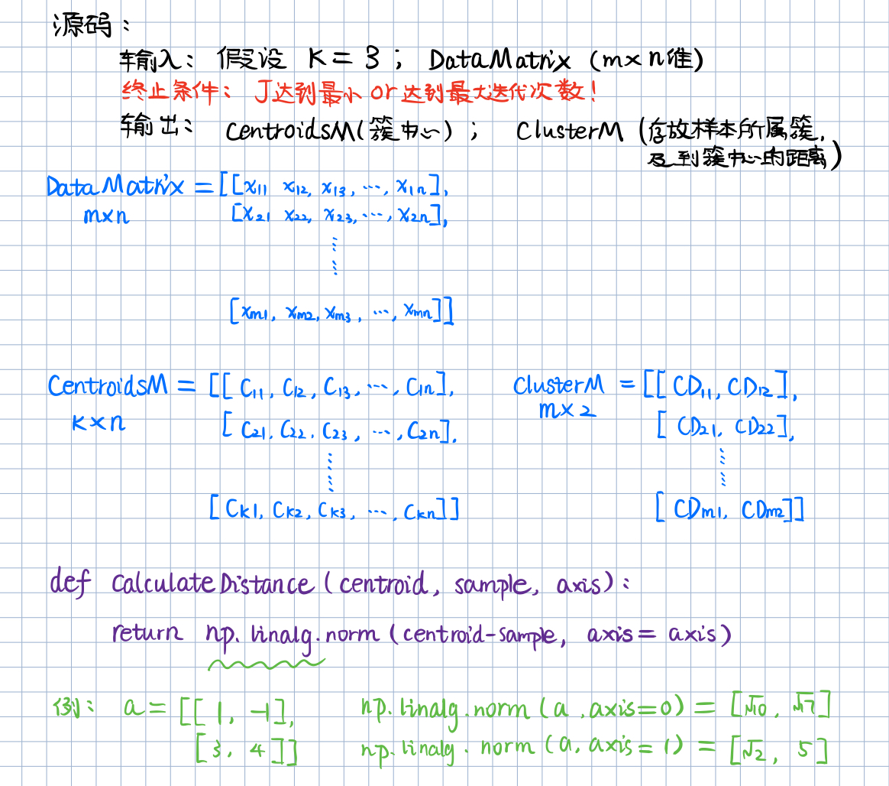
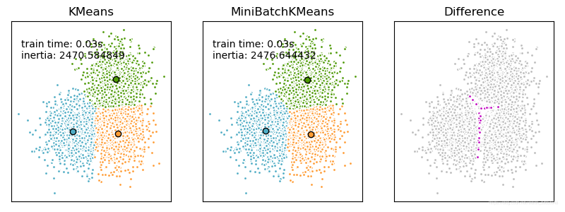
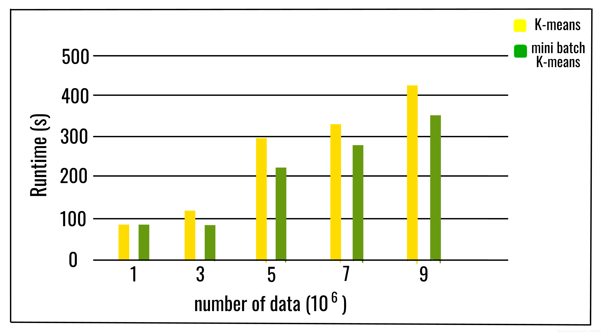

# 1. K-Means 基本理论

## 1.1 距离度量

聚类（clustering）的基本思想：根据物以类聚的原理，把数据分成不同的组或类，使得组与组之间的相似度尽可能小，而组内数据之间具有较高的相似度。聚类又被称为无监督学习（unsupervised-learning）。

聚类的目标是使得聚类内部对象之间的距离尽可能的小，或者说使它们之间具有很高的相似度。在聚类算法中，一般用距离函数来定义相似度。常用的距离度量包括：

- 1)	欧氏距离：定义了多维空间中点与点之间的直线距离。
- 2)	曼哈顿距离：亦称为街区距离，它是在多维空间内从一个对象到另一个对象的折线距离。
- 3)	切比雪夫距离：类似于从国际象棋的棋盘中的一点走到另一点的最少步数。
- 4)	余弦相似度：用向量空间中两个向量夹角的余弦值衡量两个个体间的差异的大小。
- 5)	兰氏距离：消除了量纲，克服了闵可夫斯基距离需要保持各维度指标在相同时刻级别的限制。它受离群值影响较小，适合于数据具有高度偏移的应用。
- 6)	汉明距离：用来表示两个同等长度的字符串，由一个转换为另一个的最小替换次数。

## 1.2 评估指标

- **轮廓分数（Silhouette Score）**：在不了解样本标签的情况下，评估聚类算法性能的最常用方法。它提供了每个样本索引和全局图形表示，显示了聚类的内部一致性和分离水平。
- **调整的兰德系数（ARI）**：取值范围在[-1,1]，值越大意味着聚类结果与真实情况相吻合。
- **互信息评分（MI）**：可以利用互信息衡量实际类别与预测类别的吻合程度。
- **同质性、完整性和调和平均**：范围为[0,1]，值越大代表着聚类效果与真实情况越吻合。
- **轮廓系数**：轮廓系数是所有样本轮廓系数的平均值。轮廓系数的范围为[-1,1]，同类别样本距离越近且不同类别样本距离越远，分数越高。
- **Calinski-Harabz指数**：簇之间的协方差越大，簇与簇之间界限越明显，聚类效果也就越好。簇内部数据的协方差越小，同一个簇内包含的样本越相似，聚类效果越好。

## 1.3 K-Means






## 1.3 Mini-Batch K-Means

小批量K均值算法不使用所有的数据样本，而是每次从不同聚类的样本中随机选取一部分样本来代表各自的聚类进行计算，所以精度会有损失，但是速度上会有提升。


source: [sklearn example](https://scikit-learn.org/stable/auto_examples/cluster/plot_mini_batch_kmeans.html)


source:[geeksforgeeks](https://www.geeksforgeeks.org/ml-mini-batch-k-means-clustering-algorithm/)

## 1.4 K-Means ++

K-means 是最常用的基于欧式距离的聚类算法，其认为两个目标的距离越近，相似度越大。其核心思想是：首先随机选取k个点作为初始局累哦中心，然后计算各个对象到所有聚类中心的距离，把对象归到离它最近的的那个聚类中心所在的类。重复以上过程，直到达到终止条件。

K-means算法得到的聚类结果严重依赖与初始簇中心的选择，如果初始簇中心选择不好，就会陷入局部最优解，因此提出了K-means++算法，它改进了K-means算法初始中心点的选取，其核心思想是：再选择一个新的聚类中心时，距离已有聚类中心越远的点，被选取作为聚类中心的概率越大。


---
# 2. K-Means及K-Means++源码实现

完整代码如下，自定义模块从github下载即可。

```python
import sys
import numpy as np
import pandas as pd
from copy import deepcopy
from matplotlib import pyplot as plt


from DistanceMetric import calculate_distance_multi_dims, calculate_distance
from PlotFunctions import plot_cluster_data, generate_colors, plot_k_means_centroids, plot_cluster_process_2d, plot_cluster_result_2d


def do_init_centroids(X, k, method='random'):
    """
    初始化聚类中心
    ----
    X: array, dataset
    k: int, cluster number
    method: str, 'random'(k-means); 'k-means++'
    ----
        KMeans++改进了KMeans算法选择初始质心的方式。
        其核心思想是：在选择一个聚类中心时，距离已有的聚类中心越远的点，被选取作为聚类中心的概率越大。
    """
    # 样本个数
    n_samples  = X.shape[0]
    # 样本特征数
    n_features = X.shape[1]
    
    # 生成样本索引
    indexs = np.arange(0, n_samples)
    # 打乱顺序
    # 此函数仅沿多维数组的第一个轴对数组进行打乱。子数组的顺序改变，但内容不变。
    np.random.shuffle(indexs)
    # 初始化聚类簇中心，shape=(k, n_features)
    centroids = np.zeros((k, n_features))
    
    # 类型转换，统一格式为 numpy.array
    if type(X) == pd.core.frame.DataFrame:
        X = X.to_numpy()
        
    if method == 'k-means++':
        # 从数据集中随机选择一个样本点作为第一个聚类中心
        centroids[0, ] = X[indexs[0], :]
        print(centroids.shape)
        
        # 从剩余样本中选择 k - 1 个聚类中心
        for centroid in range(k - 1):
            # 定义一个列表存储离聚类中心最近的样本点
            dists = []
            
            for i in range(n_samples):
                # 单一样本
                point = X[i, :]
                # 初始化距离
                min_dist = sys.maxsize
                
                # 计算 point 与之前的每一个聚类中心的距离 
                # 选择质心并存储最小距离
                for j in range(len(centroids)):
                    # temp_dist = calculate_distance_multi_dims(point, centroids[j], axis=0)
                    temp_dist = calculate_distance(point, centroids[j], method='euclidean', p=None)
                    # 存储最小距离
                    min_dist = min(min_dist, temp_dist)
                    
                dists.append(min_dist)
                
            # 遍历完样本之后，选择距离最大的数据点作为下一个质心
            max_dist = np.argmax(np.array(dists))
            next_centroid = X[max_dist, :]
            # 存储第二个及其之后的聚类中心
            centroids[centroid+1, :] = next_centroid
            
            # dists 清零
            dists = []
            
    # 随机初始化：即随机从样本中选择 k 个样本点作为初始聚类中心
    else:
        # 取打乱顺序之后的前 k 个样本作为初始聚类中心
        top_k_index = indexs[:k]
        # 用这k个样本的值作为初始化的簇中心
        centroids = X[top_k_index, :]

    return centroids


def k_means(X, n_cluster, init_method='random', n_iter=100, plot_process=False):
    init_centroids = do_init_centroids(X, k=n_cluster, method=init_method)
#     print(init_centroids.shape)
    
    # 类型转换，统一格式为 numpy.array
    if type(X) == pd.core.frame.DataFrame:
        X = X.to_numpy()
        
    # 用于保存聚类中心更新前的值
    old_centroids = np.zeros(init_centroids.shape)
#     print(old_centroids.shape)
    
    # 更新后的聚类中心的值
    new_centroids = deepcopy(init_centroids)
    
    # 用于保存数据所属的簇
    n_samples = len(X)
    clusters = np.zeros(n_samples)
    
    # 迭代标识符，计算新旧聚类中心的距离
    distance_flag = calculate_distance_multi_dims(init_centroids, old_centroids, axis=1)
    
    if n_iter:
        current_iter = 1
        iteration_flag = (current_iter < n_iter)
    # 去掉最大循环次数限制
    else:
        iteration_flag = True
        
    # 若聚类中心不再变化或者迭代次数超过n_iter次(可取消)，则退出循环
    while distance_flag.any() != 0 and iteration_flag:
        # 1. 计算每个样本点所属的簇（距离最近的簇）
        for i in range(n_samples):
            # 样本与k个聚类中心的距离
            distances = calculate_distance_multi_dims(X[i], new_centroids, axis=1)
            # 当前样本与k个聚类中心的最近距离
            cluster = np.argmin(distances)
            # 记录当前样本点所属的聚类中心
            clusters[i] = cluster
            
        # 2. 更新聚类中心
        # 记录更新前的聚类中心
        old_centroids = deepcopy(new_centroids)
        
        # 属于同一个簇的样本点放到一个数组中，然后按照列的方向取平均值
        for i in range(n_cluster):
            points = [X[j] for j in range(len(X)) if clusters[j] == i]
            new_centroids[i] = np.mean(points, axis=0)
            
        # 3. 判断是否满足迭代停止条件
        if current_iter % 5 == 0:
            print(f"[INFO] Iteration {current_iter}：distance_flag = {distance_flag}.")
        
        distance_flag = calculate_distance_multi_dims(new_centroids, old_centroids, axis=1)
        current_iter += 1
        
        if plot_process:    # 如果绘制图像
            plt = plot_cluster_process_2d(X, new_centroids,old_centroids) # 画聚类中心的移动过程
    
    if plot_process:    # 显示最终的绘制结果
        plt.show()
        
    # 返回每个样本所属的类以及更新后的聚类中心
    return clusters, new_centroids
    
    
if __name__ == '__main__':
    from sklearn.datasets import make_blobs
    X, y = make_blobs(n_samples=800, n_features=3, centers=4)
    # Importing the dataset
    data = pd.read_csv('xclara.csv')
    print(data.shape)
    
    plot_cluster_data(data)
    plot_cluster_data(X, show_dims=3)
    
    # K-Means
    centroids = do_init_centroids(X, k=3, method='random')
    print(centroids)
    plot_k_means_centroids(X, centroids)
    clusters, centroids = k_means(X, n_cluster=3, init_method='random', n_iter=100, plot_process=True)
    plot_cluster_result_2d(X, clusters, centroids)
    
    # K-Means++
    centroids = do_init_centroids(X, k=3, method='k-means++')
    print(centroids)
    plot_k_means_centroids(X, centroids)
    clusters, centroids = k_means(X, n_cluster=3, init_method='k-means++', n_iter=100, plot_process=True)
    plot_cluster_result_2d(X, clusters, centroids)
    # skelarn K-MEANS
    from sklearn.cluster import KMeans
    

    # Number of clusters
    kmeans = KMeans(n_clusters=3)
    # Fitting the input data
    kmeans = kmeans.fit(X)
    # Getting the cluster labels
    labels = kmeans.predict(X)
    # Centroid values
    centroids = kmeans.cluster_centers_

    # Comparing with scikit-learn centroids
    print("Centroid values")
    print("Scratch")
    print(centroids) # From Scratch
    print("sklearn")
    print(centroids) # From sci-kit learn
```


---
# 3. K-Means sklearn实现

数据集获取：

- `xclara.csv`: https://www.kaggle.com/hdriss/xclara

## 3.1 K-Means

```python
import numpy as np
from sklearn.datasets import make_classification
import matplotlib.pyplot as plt
plt.rcParams['figure.dpi'] = 300

# define dataset
X, y = make_classification(n_samples=1000, 
                           n_features=2, 
                           n_informative=2,
                           n_redundant=0,
                           n_clusters_per_class=1, random_state=4)
print(X.shape,y.shape)

for class_value in range(2):
    row_ix = np.where(y == class_value)
    plt.scatter(X[row_ix, 0], X[row_ix, 1], label=class_value)

plt.xlabel('Feature 1')
plt.ylabel('Feature 2')
plt.legend()
plt.show()
```

```python
from sklearn.cluster import KMeans

model = KMeans(n_clusters=2, init='random')
model.fit(X)
yhat = model.predict(X)
clusters = np.unique(yhat)

for cluster in clusters:
    row_ix = np.where(yhat == cluster)
    plt.scatter(X[row_ix, 0], X[row_ix, 1], label=cluster)

plt.xlabel('Feature 1')
plt.ylabel('Feature 2')
plt.legend(ncol=2)
plt.show()
```


## 3.2 K-Means ++

```python
model = KMeans(n_clusters=2, init='k-means++')
model.fit(X)
yhat = model.predict(X)
clusters = np.unique(yhat)

for cluster in clusters:
    row_ix = np.where(yhat == cluster)
    plt.scatter(X[row_ix, 0], X[row_ix, 1], label=cluster)

plt.xlabel('Feature 1')
plt.ylabel('Feature 2')
plt.legend(ncol=2)
plt.show()
```


## 3.3 Mini-Batch K-Means

```python
from sklearn.cluster import MiniBatchKMeans, KMeans
from sklearn.metrics.pairwise import pairwise_distances_argmin
from sklearn.datasets import make_blobs

model = KMeans(n_clusters=2, init='k-means++')
model.fit(X)
yhat = model.predict(X)
clusters = np.unique(yhat)

for cluster in clusters:
    row_ix = np.where(yhat == cluster)
    plt.scatter(X[row_ix, 0], X[row_ix, 1], label=cluster)

plt.xlabel('Feature 1')
plt.ylabel('Feature 2')
plt.legend(ncol=2)
plt.show()
```

# 4. 聚类中心数量 k 的选取

```python
cost =[]
for i in range(1, 11):
#     km = k_means(data, n_cluster=i, init_method='k-means++', 
#                  n_iter=100, plot_process=True)
    KM = KMeans(n_clusters = i, max_iter = 500)
    KM.fit(X)
    # calculates squared error for the clustered points
    cost.append(KM.inertia_)     

# plot the cost against K values
plt.plot(range(1, 11), cost, color ='g', linewidth ='3')
plt.xlabel("Value of K")
plt.ylabel("Sqaured Error (Cost)")
plt.show() # clear the plot
```


---

# Reference

> 1. https://www.cnblogs.com/wj-1314/p/12751033.html
> 2. https://www.cnblogs.com/shenfeng/p/kmeans_demo.html
> 3. https://mubaris.com/posts/kmeans-clustering/
> 4. https://github.com/lawlite19/MachineLearning_Python/blob/master/K-Means/K-Menas.py
> 5. https://www.geeksforgeeks.org/ml-k-means-algorithm/
> 6. https://www.geeksforgeeks.org/ml-mini-batch-k-means-clustering-algorithm/

